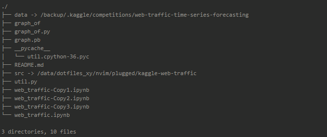

the ipynb, and util is a exploring for a keras winner model of tensorflow
1. exploring the graph instead of its source code
2. import the graph instead of the source code

result: still failed

1. the graph variable issue, variable must import as a constant, then can be feed with value
2. the graph has too many sub graph, there is operation in convert to const, the exact sub,
hard to exact whole graph with multiple sub graph
